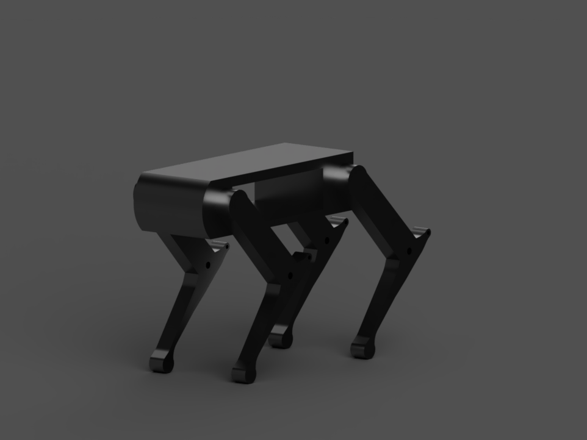

# Robotic Dog Design

## Overview

This project presents a simplified quadruped robotic dog designed as part of the Mechanical Engineering training tasks.

The model was created in Fusion 360 and exported as STL files for 3D printing and prototyping purposes.

## Design Features

- Four-legged robotic structure
- Simplified mechanical design
- Lightweight body frame
- STL files ready for 3D printing
- Designed using Fusion 360

## Software Used

- Fusion 360

## Files Included

- `robotic_dog.stl`
- `preview.png`

## Preview

  

## Design Process

1. Created the main body structure.
2. Designed the leg assemblies.
3. Positioned the legs around the body.
4. Finalized the robotic dog model.
5. Exported the model as STL files.

## Applications

- Educational robotics
- Mechanical design practice
- 3D printing projects
- Quadruped robot concepts

## Author

V
